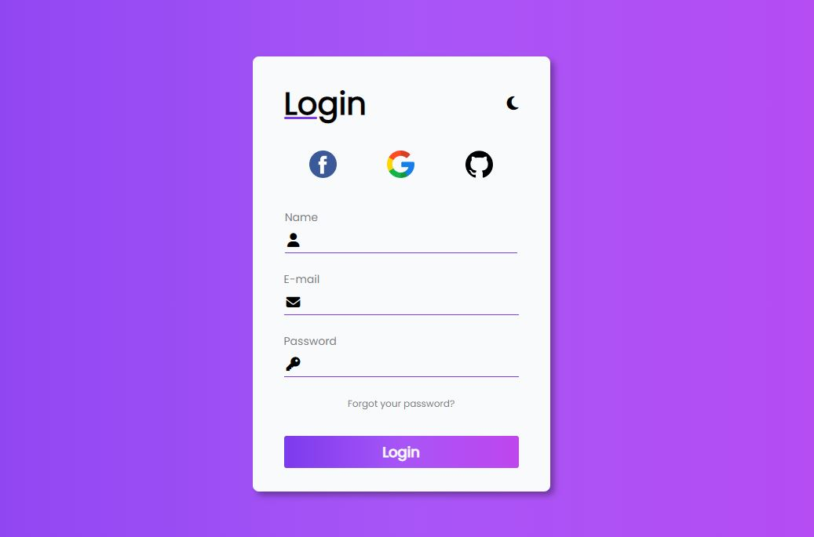
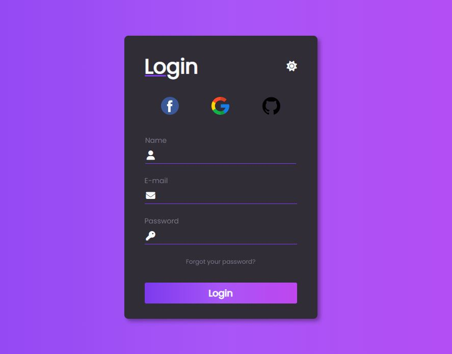

<h1 align="center"> Formulario com modo Dark/Light </h1>

Formulario desenvolvido através de um tutorial no youtube para estudar sobre como implementar o modo escuro em sites WEB.  

  <a href="#-tecnologias">Tecnologias</a>&nbsp;&nbsp;&nbsp;|&nbsp;&nbsp;&nbsp;
  <a href="#-projeto">Projeto</a>&nbsp;&nbsp;&nbsp;|&nbsp;&nbsp;&nbsp;
  <a href="#-layout">Layout</a>&nbsp;&nbsp;&nbsp;|&nbsp;&nbsp;&nbsp;
  <a href="#memo-licença">Licença</a>

  

 

<h1 align="center">Light</h1>
  
<h1 align="center">Dark</h1>
  

## 🚀 Tecnologias

Esse projeto foi desenvolvido com as seguintes tecnologias:

- HTML e CSS
- JavaScript
- Git e Github
- Font Awesome

## 💻 Projeto

Formulario desenvolvido para estudar sobre o modo Light e Modo Dark em sites Web.

- [Visite o projeto online](https://matheuspieta.github.io/Formulario_Dark_light/)

## 🔖 Layout

Você pode visualizar o tutorial do projeto através [DESSE LINK](https://www.youtube.com/watch?v=LOjQYWRJmbk&ab_channel=LarissaKich).

## :memo: Licença

Esse projeto está sob a licença MIT.

---

Feito com ♥ by Matheus Pieta
